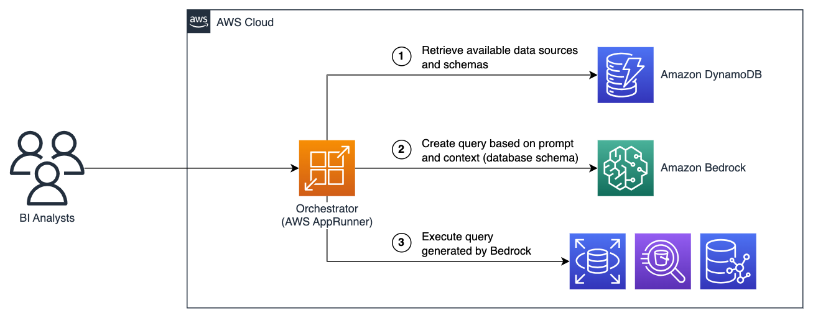
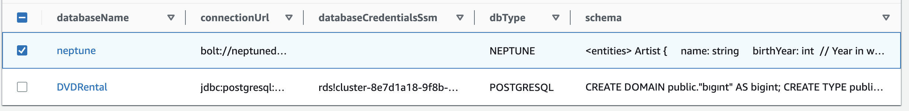

# Query structured data with natural language using Amazon Bedrock

<p align="center">
    <a href="https://aws.amazon.com/industries/" alt="Industry: Cross-Industry">
        </a>
    <a href="https://aiexplorer.aws.amazon.com/?search=business+intelligence" alt="Horizontal Use-Case: Business Intelligence">
        </a>
    <a href="https://aiexplorer.aws.amazon.com/?search=code+generation" alt="Horizontal Use-Case: Code Generation">
        </a>
</p>

In this sample, we show how you can use Large Language Models (LLMs) to translate natural language questions into analytical queries against structured data sources like SQL and graph databases.

This can accelerate self-serve exploratory data analysis by reducing the time and skills required to translate business questions into technical query languages.


## When (not) to use this pattern

In general, so long as the schema of available data is provided to the language model, we've observed:

- Good performance out-of-the-box for generating SQL queries
- Acceptable performance after coaching/prompt-engineering for generating OpenCypher graph queries.

Automated query generation can fail or produce unexpected results for a range of reasons, including:

- Asking questions that are not answerable from the underlying data source
- Misunderstanding the meaning or context of the schema of the underlying data source
- Failing to generate valid queries in the target query language
- Malicious user input attempting to modify the database (or deny service to other users by intentionally consuming a large amount of resources)

Because of this, use-cases should consider the following best practices:

1. Show generated queries (and also the LLM's reasoning) to users to help them validate whether the answering method looks correct from their knowledge of the data schema.
2. Secure your applications by:
    - Restricting database access to read-only queries (and ideally propagating users' own identities through to the database connection!) - to prevent maliciously constructed queries from modifying or accessing unintended data.
    - Limiting per-user or per-query run time and resources, to prevent a few demanding users from degrading database query performance for others.

⚠️ **Today this sample demonstrates the above practice 1, but practice 2 is not fully implemented**. This sample is not recommended for deployment in production environments.

## Architecture Overview

Modern Generative AI models are capable (with some limitations) of reasoning over and generating both natural languages (like English) and computer programming languages (like SQL, GraphQL, Gremlin and Cypher).

In this sample users enter natural-language questions that should be answerable from organizational data sources, and we apply an LLM on [Amazon Bedrock](https://aws.amazon.com/bedrock/) to draft a database query equivalent: Automating work that would otherwise require support from a skilled data analyst. An orchestrator runs this query against the data source and presents the results to the user, as shown in the architecture diagram below:



To support transparency and verification, the LLM also attempts to explain the reasoning behind the generated query, and both the query and the explanation are surfaced to the user alongside the results.

Available data sources and their schemas are configured in a DynamoDB table, which records both structured connection attributes (like `connectionUrl`, `dbType`, `databaseCredentialsSsm`) and free text `schema` information. The target database's `schema` is passed as input to the LLM, to surface which fields and relations are available.

Although automated schema crawling should be possible in principle, we note that **annotating** your schemas with additional commentary can significantly improve results (especially e.g. in cases where there are counter-intuitive or non-obvious field names and relations). This sample does not yet crawl data source schemas automatically.

The sample supports 3 example data sources and by default pre-populates an example dataset for each:

- [Amazon Athena](https://aws.amazon.com/athena/) serverless structured data analytics, pre-populated with the [TPC-H](https://docs.snowflake.com/en/user-guide/sample-data-tpch) supply-chain oriented business decision benchmarking dataset.
- [Amazon Neptune](https://aws.amazon.com/neptune/) graph database, pre-populated with an [Internet Movie Database (IMDb)](https://catalog.us-east-1.prod.workshops.aws/workshops/2ae99bf2-10df-444f-a21f-8ad0537a9bdd/en-US/workshop2/opencypher/model) sample dataset.
- [Amazon RDS for Postgres](https://dev.mysql.com/doc/sakila/en/sakila-structure.html) SQL database, pre-populated with the [Sakila](https://dev.mysql.com/doc/sakila/en/sakila-structure.html) DVD rentals sample dataset.


## Getting Started

This sample is built with [AWS CDK](https://aws.amazon.com/cdk/), which requires setting up a development environment as described below. However, if you'd like to **just deploy the stack as-is** - you can use the one-click CloudFormation template linked below:

**TODO: Populate once the public GitHub URL is ready because we need that first**

> **Configuration notes:**
>
> - You'll need to target an AWS Region (e.g. `N. Virginia`) where Bedrock is currently supported and Anthropic Claude text generation models have been [enabled](https://docs.aws.amazon.com/bedrock/latest/userguide/model-access.html)


## Customizing the stack

### CDK Pre-requisites

To set up and customize this sample with CDK, you'll need a development environment with:

- Installed [NodeJS v18+](https://nodejs.org/en/download)
- Installed [Java Development Kit (JDK)](https://openjdk.org/), and [Maven](https://maven.apache.org/install.html)
- Running [Docker](https://www.docker.com/products/docker-desktop/)
- (AWS CLI) logged in to your AWS Account
- Targeting a region (e.g. `export AWS_REGION=us-east-1`) where Bedrock is currently supported and Anthropic Claude text generation models have been [enabled](https://docs.aws.amazon.com/bedrock/latest/userguide/model-access.html).
- To [log docker CLI in](https://docs.aws.amazon.com/AmazonECR/latest/public/public-registries.html#public-registry-auth) to Amazon ECR Public: `aws ecr-public get-login-password --region us-east-1 | docker login --username AWS --password-stdin public.ecr.aws`

### End-to-end CDK setup

To deploy the solution via AWS CDK (once you have the pre-requisites above):

- Open your terminal in the `cdk` subfolder
- `npm install` to install dependencies of the solution
- `npx cdk bootstrap` if you haven't already [bootstrapped](https://docs.aws.amazon.com/cdk/v2/guide/bootstrapping.html) your target AWS environment for CDK deployments
- `npx cdk deploy`
    - This will attempt to install dependencies and compile the Java application locally (so you must have Java installed) before running the actual CDK synth/deployment.
    - If you don't want all three sample data sources (Amazon Athena, Amazon Neptune and Amazon RDS) to be created, consider editing the `disable*` parameters in [cdk/bin/cdk.ts](cdk/bin/cdk.ts) before deploying.
- ⏰ Check in CloudWatch ([as described here](https://catalog.us-east-1.prod.workshops.aws/workshops/2ae99bf2-10df-444f-a21f-8ad0537a9bdd/en-US/appendix)) that your Neptune data is fully copied (which may take some additional time after the main stack deployment is finished)

That should be it! The deployed stack should list your application URL as an output, or you can go find the service in the [AWS AppRunner Console](https://console.aws.amazon.com/apprunner/home?#/services).


### Manual setup

If there's a problem with the CDK solution, or you want to customize the solution after deployment without building your changes in through CDK, see the "Advanced setup notes" section below.


## Sample Questions

In this section we share some sample questions you might like to try. For more ideas, check out the schemas of the sample datasets loaded into each source. 

### Athena

* Which 10 customers from ASEAN placed the most orders?
* what parts are low in stock?
* show me the top 5 parts that were returned eventually
* show me the top 10 suppliers from Jordan with highest sales
* show me the number of customers from the African continent who have not places any orders between Jan 2nd and Nov 2nd of 1994
* who are the top 50 customers that haven't bought wood parts yet are most likely to in future?
* which 10 products are bought most frequently together?
* **Other languages:** 
    *  montrez-moi le top 5 des produits les plus achetés

### Neptune

> Although many queries perform well in Neptune, we've observed lower success rate than with SQL data sources. The most common cause of failures is attempting to traverse relations in the wrong direction e.g. `(Artist)-[:actor]->(movie)` instead of `(movie)-[:actor]->(Artist)`, which normally produces empty result sets. We've also sometimes seen invalid queries generated due to mixing SQL patterns in with Cypher.

* Who's Quentin Tarantino's favourite actor?
* How many movies has Robin Williams starred in by genre?
* What's the average run time of movies directed by Quentin Tarantino
* What movies did Angelina Jolie star in before 1996?
* What movie launched Jonny Lee Miller's career?
    * This one is unusual because from the query you can tell the LLM already looks in a specific year...
* **Other languages:**
    * Welches ist das Genre in dem Robin Williams die meisten Filme gedreht hat?
    * アンジェリーナジョリーの最初の映画はいつか？
    * Angelina JolieとJonny Lee Millerとはどちらが一番人気ですか

### RDS

* Show me the name of the 5 customers who rented the most dvds
* Find the 5 actors whose movies have been rented the most
* How many rentals have there been in average per customer
* Give me the name of the category which has been rented most often
* Other languages:
    * Welche Filme wurden am meisten ausgeliehen?


## Advanced Setup Notes

The main components of the solution to configure include:

1. The orchestrating web application, which runs as a Java Spring application in AWS AppRunner
2. The DynamoDB table listing accessible data sources
3. The data sources you'd like to connect to (which must also be supported by the Java app)


### AppRunner setup

The Java application depends on the [Amazon Athena JDBC Connector](https://docs.aws.amazon.com/athena/latest/ug/connect-with-jdbc.html#download-the-jdbc-driver-no-sdk), which needs to be downloaded separately from other dependencies. We've configured the `maven-download-plugin` to help with this, so you can build the application by running the same build commands as used in [cdk/lib/orchestrators/java-app.ts](cdk/lib/orchestrators/java-app.ts):

```sh
# (From the app-java/ folder)

# Fetch the Athena JDBC .jar:
mvn process-resources
# Install the Athena JDBC .jar:
mvn install:install-file  -Dfile=lib/AthenaJDBC42-2.1.1.1000.jar  -DgroupId=Athena  -DartifactId=AthenaJDBC42  -Dversion=2.1.1.1000  -Dpackaging=jar  -DgeneratePom=true
# Build the rest of the Java app:
mvn install
mvn clean package
```

Once the Java application is built:

* Build the container image using (Docker or) `finch build --platform linux/amd64 -t <ACCOUNT_ID>.dkr.<REGION>.amazonaws.com/<ECR_REPO_NAME>:latest .`
* Push the image to ECR `finch push <ACCOUNT_ID>.dkr.ecr.<REGION>.amazonaws.com/<ECR_REPO_NAME>:latest`
* Create a AppRunner service pointing to your image inside ECR
* Make sure to select `Custom VPC` as the networking mode and add a VPC Connector pointing to your subnets containing your data sources.
* Pass the DynamoDB Table Name to the Application via the environment variable BEDROCK_DATA_EXPLORATION_DYNAMO_TABLE_NAME

Once your solution is set up and the AppRunner app deployed, you should be able to navigate to its URL in your browser and start asking questions to your data!

### DynamoDB table of data source configurations

New data sources (of supported types) are connected by adding/updating entries to the DynamoDB data sources table.

Each item in the data sources table should contain:

* `databaseName`: A human-readable name for the data source (which will appear in the user's view)
* `dbType`: Currently supports `ATHENA`, `NEPTUNE`, or `POSTGRESQL` (must also be supported by the Java app)
* `schema`: A text representation of the database schema (which will be injected into the LLM query generation prompt)
* `connectionUrl`: A [JDBC](https://en.wikipedia.org/wiki/Java_Database_Connectivity)-like connection string containing the required configuration to connect to the database.
* (`databaseCredentialsSsm`): Optional name of the AWS Secrets Manager secret storing the credentials to connect to the database (for RDS).




### Graph data with Amazon Neptune data sources

You can create a Neptune graph database cluster and reference it as a data source.

Neptune clusters can *only* be deployed within an AWS VPC to limit access, and you should check your AppRunner service can reach (via [VPC Connector](https://docs.aws.amazon.com/apprunner/latest/dg/network-vpc.html) and relevant subnets/routing) the target cluster. Check also that the **security groups** allow connectivity from AppRunner to the Neptune cluster endpoint(s).

To create a cluster and load the IMDb sample dataset as we do for the sample: in [AWS CloudFormation](https://console.aws.amazon.com/cloudformation/home), deploy the following stack as used by the ["Build Your First Graph Application with Amazon Neptune" workshop](https://catalog.us-east-1.prod.workshops.aws/workshops/2ae99bf2-10df-444f-a21f-8ad0537a9bdd/en-US/appendix): https://neptune-workshop-assets.s3.amazonaws.com/neptune-immersion-day.yaml

This stack will automatically deploy a Neptune cluster and **start** ingesting the IMDb sample data. Note that it will **⏰ take additional time** after stack creation for the full ~15GB data load to complete - and you can check progress [as described here](https://catalog.us-east-1.prod.workshops.aws/workshops/2ae99bf2-10df-444f-a21f-8ad0537a9bdd/en-US/appendix).

As shown in the `dataSourceDescriptor` property of [cdk/lib/data-sources/neptune.ts](cdk/lib/data-sources/neptune.ts), the data source descriptor entry in DynamoDB should use the `bolt://` connection scheme in the following form:

```json
{
    "databaseName": "{Human-readable name}",
    "connectionUrl": "bolt://{Cluster Endpoint}:{Port number}",
    "dbType": "NEPTUNE",
    "schema": "{Annotated entity & relation schema for your database}"
}
```

For graph databases / Cypher queries, we've observed LLMs can struggle to consistently navigate one-way relations in the correct direction - sometimes resulting in returning empty result sets. You can refer to [cdk/lib/data-sources/neptune.ts](cdk/lib/data-sources/neptune.ts) for our attempt at prompt engineering this into the database schema.


### SQL data with Amazon RDS (for PostgreSQL) data sources

You can create an RDS cluster and reference it as a data source. We've only tested with Postgres-based clusters so far.

RDS databases are typically deployed within an AWS VPC to limit access, in which case you should check your AppRunner service can reach (via [VPC Connector](https://docs.aws.amazon.com/apprunner/latest/dg/network-vpc.html) and relevant subnets/routing) the target cluster. Check also that the **security groups** allow connectivity from AppRunner to the RDS cluster/instances.

For our sample, we load the [Pagila sample dataset](https://github.com/devrimgunduz/pagila) into RDS using the SQL statements available at https://raw.githubusercontent.com/devrimgunduz/pagila/master/pagila-schema.sql and https://raw.githubusercontent.com/devrimgunduz/pagila/master/pagila-insert-data.sql. These are executed through an AWS Lambda function ([cdk/lib/data-sources/lambda-load-data/rds.ts](cdk/lib/data-sources/lambda-load-data/rds.ts)) with connectivity to the target VPC and subnets. You could alternatively use an EC2 Bastion Host or similar, to access your RDS cluster.

As shown in the `dataSourceDescriptor` property of [cdk/lib/data-sources/rds.ts](cdk/lib/data-sources/rds.ts), the access credentials for the database should be kept in [AWS Secrets Manager](https://docs.aws.amazon.com/secretsmanager/latest/userguide/intro.html) and the data source descriptor entry in DynamoDB for RDS PostgreSQL sources should have the form:

```json
{
    "databaseName": "{Human-readable name}",
    "connectionUrl": "jdbc:postgresql://{Cluster read-only query endpoint including :PortNumber}/{Database name}",
    "databaseCredentialsSsm": "{AWS Secrets Manager Secret Name}",
    "dbType": "POSTGRESQL",
    "schema": "{Schema/creation commands of your DB}"
}
```

### S3 data with Amazon Athena data sources

You can query S3 data or any federation supported data sources using Amazon Athena. For the sample [TPC-H dataset](https://www.tpc.org/TPC_Documents_Current_Versions/pdf/TPC-H_v3.0.1.pdf), you can set up by running the SQL script as given in the `getCreationQueryString()` method of [cdk/lib/data-sources/athena.ts](cdk/lib/data-sources/athena.ts).

As shown in the `dataSourceDescriptor()` property of [cdk/lib/data-sources/athena.ts](cdk/lib/data-sources/athena.ts), the data source descriptor entry in DynamoDB for Athena sources should have the form:

```json
{
    "databaseName": "{Human-readable name}",
    "connectionUrl": "jdbc:awsathena://AwsRegion={?};AwsCredentialsProviderClass=com.simba.athena.amazonaws.auth.DefaultAWSCredentialsProviderChain;Catalog={?};S3OutputLocation={?};Schema={Athena DB Name};Workgroup={?}",
    "dbType": "ATHENA",
    "schema": "{Schema or creation commands of your DB}"
}
```

Check that your AppRunner service role has appropriate permissions to query Amazon Athena.


## Ideas for improvement

This sample is a basic illustration of the pattern of natural language data analytics across various data sources, and has not been hardened for production usage. Some particular areas that could be improved include:

1. **Improved error handling:** Failed database queries often produce opaque error messages in the UI which administrators must delve into AppRunner application logs to investigate further.
2. **Additional security controls** to scope down database access, including:
    - Preventing data editing queries to Amazon Athena
    - Passing users' own identities through to database interactions instead of using service-level credentials
    - Enforcing limits to prevent demanding user queries from degrading service for other concurrent users
3. **Extended functionality** including:
    - An additional LLM call to *automatically select* the correct data source for a given question, instead of requiring a user selection.
    - APIs or UIs to add and manage data sources
    - Going beyond presenting query result sets to answering user queries in natural language (without sacrificing transparency to the underlying query & results).
    - Supporting additional database types


## Cleaning Up

To release your cloud resources and avoid ongoing costs once you're finished exploring this sample, you can delete the created stacks in [AWS CloudFormation](https://console.aws.amazon.com/cloudformation/home?#/stacks/) or (if you deployed with AWS CDK) run `npx cdk destroy`. In addition:

- You'll probably note that the stack's `AthenaBucket` fails to delete because it contains objects. You click through from CloudFormation to find this bucket in the Amazon S3 Console and delete all objects inside, after which you should be able to delete the stack successfully.
- The stack does not automatically delete the `bedrockathena` catalog in Amazon Athena. You can (and if you want to re-deploy the stack in the same AWS Account without errors, **must**) delete all the tables and the `bedrockathena` catalog. This can be done from the [Query Editor in the Amazon Athena Console](https://console.aws.amazon.com/athena/home?#/query-editor/): so long as you've [set up a default S3 location](https://docs.aws.amazon.com/athena/latest/ug/getting-started.html#prerequisites) to store your console query results.

## Security

See [CONTRIBUTING](CONTRIBUTING.md#security-issue-notifications) for more information.

## License

This library is licensed under the MIT-0 License. See the LICENSE file.
